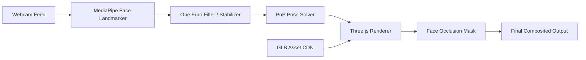
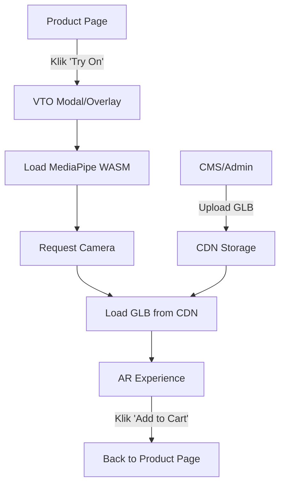

# 📖 VTO Eyewear — Wiki & Technical Reference

> Dokumen acuan untuk membangun Virtual Try-On (VTO) kacamata berkualitas production untuk web marketplace dengan ~50 SKU frame.

---

## 1. Arsitektur Sistem



### Tech Stack (Web-Only, No Python)

| Layer | Technology | Alasan |
|---|---|---|
| **Face Tracking** | `@mediapipe/tasks-vision` (FaceLandmarker) | 478 landmarks, 3D pose matrix, runs in WASM — paling akurat untuk browser |
| **3D Rendering** | Three.js + `@react-three/fiber` | Industry standard WebGL, ekosistem besar, GLB/GLTF native support |
| **Stabilization** | One Euro Filter | Low-latency jitter removal, lebih baik dari lerp |
| **Framework** | React + Vite + TypeScript | Fast HMR, tree-shaking, type safety |
| **Asset Delivery** | CDN (CloudFront/Bunny) | 50 GLB files harus lazy-loaded, bukan bundled |
| **State** | Zustand atau custom store | Lightweight, no boilerplate |

---

## 2. Face Tracking & Landmark Mapping

### 2.1 Key Landmarks untuk Kacamata

```
Landmark 168 → Nose bridge (anchor utama)
Landmark 6   → Nose tip
Landmark 33  → Left eye outer corner
Landmark 263 → Right eye outer corner  
Landmark 133 → Left eye inner corner
Landmark 362 → Right eye inner corner
Landmark 70  → Left eyebrow inner
Landmark 300 → Right eyebrow inner
Landmark 234 → Left temple (untuk gagang)
Landmark 454 → Right temple (untuk gagang)
```

### 2.2 Multi-Landmark Anchor (Wajib!)

Jangan pakai 1 titik saja. Pakai **weighted average** dari beberapa landmark:

```typescript
function computeAnchor(landmarks: NormalizedLandmark[]) {
  // Weighted center antara nose bridge dan kedua inner eye corners
  const nose = landmarks[168];
  const leftInner = landmarks[133];
  const rightInner = landmarks[362];
  
  return {
    x: nose.x * 0.5 + leftInner.x * 0.25 + rightInner.x * 0.25,
    y: nose.y * 0.5 + leftInner.y * 0.25 + rightInner.y * 0.25,
    z: nose.z * 0.5 + leftInner.z * 0.25 + rightInner.z * 0.25,
  };
}
```

### 2.3 Dynamic Scale dari Eye Distance

```typescript
function computeGlassesScale(landmarks: NormalizedLandmark[], viewportWidth: number) {
  const left = landmarks[33];   // left eye outer
  const right = landmarks[263]; // right eye outer
  
  const dx = right.x - left.x;
  const dy = right.y - left.y;
  const eyeDistance = Math.sqrt(dx*dx + dy*dy) * viewportWidth;
  
  // Scale kacamata proporsional dengan jarak antar mata
  const MODEL_REFERENCE_WIDTH = 2.8; // sesuaikan per model
  return eyeDistance / MODEL_REFERENCE_WIDTH;
}
```

---

## 3. Stabilisasi: One Euro Filter

> [!IMPORTANT]
> Ini adalah **single most impactful improvement**. Menghilangkan 90% jitter tanpa menambah latency.

### Konsep
One Euro Filter adalah adaptive low-pass filter:
- **Saat diam** → smoothing tinggi (cutoff rendah) → stabil
- **Saat gerak cepat** → smoothing rendah (cutoff tinggi) → responsif

### Implementasi

```typescript
class OneEuroFilter {
  private freq: number;
  private mincutoff: number;
  private beta: number;
  private dcutoff: number;
  private x: LowPassFilter;
  private dx: LowPassFilter;
  private lasttime: number;

  constructor(freq = 120, mincutoff = 1.0, beta = 0.007, dcutoff = 1.0) {
    this.freq = freq;
    this.mincutoff = mincutoff;
    this.beta = beta;
    this.dcutoff = dcutoff;
    this.x = new LowPassFilter(this.alpha(mincutoff));
    this.dx = new LowPassFilter(this.alpha(dcutoff));
    this.lasttime = -1;
  }

  private alpha(cutoff: number) {
    const te = 1.0 / this.freq;
    const tau = 1.0 / (2 * Math.PI * cutoff);
    return 1.0 / (1.0 + tau / te);
  }

  filter(x: number, timestamp?: number): number {
    if (this.lasttime !== -1 && timestamp !== undefined) {
      this.freq = 1.0 / (timestamp - this.lasttime);
    }
    this.lasttime = timestamp ?? this.lasttime;

    const prevX = this.x.hasLastValue() ? this.x.lastValue() : x;
    const dx = (x - prevX) * this.freq;
    const edx = this.dx.filterWithAlpha(dx, this.alpha(this.dcutoff));
    const cutoff = this.mincutoff + this.beta * Math.abs(edx);
    return this.x.filterWithAlpha(x, this.alpha(cutoff));
  }
}

class LowPassFilter {
  private y: number | null = null;
  private s: number | null = null;

  constructor(private a: number) {}

  hasLastValue() { return this.s !== null; }
  lastValue() { return this.s!; }

  filterWithAlpha(value: number, alpha: number): number {
    this.a = alpha;
    if (this.s === null) {
      this.s = value;
    } else {
      this.s = alpha * value + (1 - alpha) * this.s;
    }
    this.y = value;
    return this.s;
  }
}
```

### Penggunaan: 1 filter per axis (x, y, z, qx, qy, qz, qw, scale)

```typescript
// Di GlassesOverlay.tsx
const filters = {
  px: new OneEuroFilter(120, 1.0, 0.007),
  py: new OneEuroFilter(120, 1.0, 0.007),
  pz: new OneEuroFilter(120, 0.5, 0.003),
  qx: new OneEuroFilter(120, 0.5, 0.001),
  qy: new OneEuroFilter(120, 0.5, 0.001),
  qz: new OneEuroFilter(120, 0.5, 0.001),
  qw: new OneEuroFilter(120, 0.5, 0.001),
  scale: new OneEuroFilter(120, 0.3, 0.001),
};

// Di useFrame:
const t = performance.now() / 1000;
const sx = filters.px.filter(rawX, t);
const sy = filters.py.filter(rawY, t);
// ... dst
```

> [!TIP]
> Parameter tuning: `mincutoff` tinggi = lebih responsif tapi lebih noisy. `beta` tinggi = lebih cepat bereaksi terhadap gerakan.

---

## 4. Face Occlusion (Hidung Menutupi Frame)

> Ini yang bikin VTO terlihat **realistis** — hidung dan pipi bisa menutupi sebagian frame kacamata.

### Cara Kerja
1. Ambil face mesh triangles dari MediaPipe (468 vertices)
2. Render sebagai **invisible mesh** (colorWrite: false, depthWrite: true)
3. Render kacamata **setelahnya** — depth test otomatis bikin hidung "menutupi" frame

```typescript
// Face Occlusion Mesh
const occlusionMaterial = new THREE.MeshBasicMaterial({
  colorWrite: false,    // Tidak terlihat di layar
  depthWrite: true,     // TAPI menulis ke depth buffer
  side: THREE.DoubleSide,
});

// Render order penting!
// occlusionMesh.renderOrder = 0;  (render duluan)
// glassesMesh.renderOrder = 1;    (render setelahnya, di-clip oleh depth)
```

### Simplified Occlusion (Nose-Only)

Kalau full face mesh terlalu berat, cukup buat **nose occlusion cone**:

```typescript
// Pakai landmark 1 (nose tip), 168 (bridge), 4 (nose bottom)
// Buat simple cone/cylinder geometry yang menutupi area hidung
const noseOccluder = new THREE.Mesh(
  new THREE.ConeGeometry(0.3, 0.8, 8),
  occlusionMaterial
);
noseOccluder.renderOrder = 0;
```

---

## 5. 3D Model Pipeline (untuk 50 SKU)

### 5.1 Standar Model GLB

> [!IMPORTANT]
> Semua 50 model HARUS mengikuti standar yang sama agar VTO konsisten.

| Property | Standar |
|---|---|
| **Format** | `.glb` (binary GLTF) |
| **Origin** | Center of nose bridge (0, 0, 0) |
| **Facing** | Menghadap -Z (ke arah kamera) |
| **Unit** | 1 unit = 1 meter (standar GLTF) |
| **Total width** | ~0.14m (14cm, ukuran kacamata real) |
| **Max file size** | < 2MB per model (compressed) |
| **Materials** | PBR Metallic-Roughness (BUKAN SpecularGlossiness) |
| **Texture size** | Max 1024x1024 |
| **Polycount** | < 15,000 triangles |

### 5.2 Blender Export Settings

```
File → Export → glTF 2.0 (.glb)
├─ Format: glTF Binary (.glb)
├─ Include: Selected Objects only
├─ Transform:
│   └─ +Y Up ✓
├─ Geometry:
│   ├─ Apply Modifiers ✓
│   ├─ UVs ✓
│   ├─ Normals ✓
│   └─ Compression ✓ (Draco)
├─ Materials: Export
└─ Animation: UNCHECK (tidak perlu)
```

### 5.3 Draco Compression (Wajib untuk 50 SKU!)

```bash
# Install gltf-transform CLI
npm install -g @gltf-transform/cli

# Compress semua model
for file in models/*.glb; do
  gltf-transform draco "$file" "compressed/$file" --method edgebreaker
done

# Typical result: 5MB → 800KB per model
```

### 5.4 Asset Loading Strategy

```typescript
// Lazy load — jangan preload semua 50 model!
const modelCache = new Map<string, THREE.Group>();

async function loadGlasses(skuId: string): Promise<THREE.Group> {
  if (modelCache.has(skuId)) return modelCache.get(skuId)!.clone();
  
  const { scene } = await useGLTF.load(`/models/${skuId}.glb`);
  modelCache.set(skuId, scene);
  return scene.clone();
}

// Preload hanya yang visible di carousel
function preloadVisible(skuIds: string[]) {
  skuIds.slice(0, 5).forEach(id => useGLTF.preload(`/models/${id}.glb`));
}
```

---

## 6. Performance Budget (Web Marketplace)

> [!WARNING]
> VTO berjalan di atas halaman marketplace. Harus ringan!

### Target Metrics

| Metric | Target | Cara Ukur |
|---|---|---|
| FPS | ≥ 30 FPS (ideal 60) | `stats.js` overlay |
| Initial Load | < 3 detik | Lighthouse |
| MediaPipe WASM | ~4MB (one-time) | Network tab |
| Per-model GLB | < 1MB | `ls -la` |
| Memory | < 200MB total | Chrome Task Manager |
| CPU Usage | < 40% single core | Performance tab |

### Optimization Checklist

- [ ] **Lazy init** — Jangan load MediaPipe sampai user klik "Try On"
- [ ] **Throttle tracking** — 30 FPS cukup, tidak perlu 60
- [ ] **Dispose textures** — `texture.dispose()` saat ganti model
- [ ] **Object pooling** — Reuse Three.js objects, jangan recreate
- [ ] **Web Worker** — Pindahkan MediaPipe ke Worker thread (advanced)
- [ ] **OffscreenCanvas** — Render Three.js di Worker (Chrome only)

```typescript
// Throttle tracking ke 30 FPS
let lastFrameTime = 0;
const FRAME_INTERVAL = 1000 / 30; // 33ms

function processFrame(timestamp: number) {
  if (timestamp - lastFrameTime < FRAME_INTERVAL) {
    requestAnimationFrame(processFrame);
    return;
  }
  lastFrameTime = timestamp;
  
  // ... face tracking logic
  requestAnimationFrame(processFrame);
}
```

---

## 7. Rotation: PnP Pose Estimation

### Kenapa Lebih Baik dari Raw Matrix?

MediaPipe kasih `facialTransformationMatrix` tapi itu bisa noisy. PnP (Perspective-n-Point) menghitung rotasi dari korelasi 2D→3D yang lebih stabil.

```typescript
// Simplified PnP menggunakan 6 anchor points
const MODEL_POINTS_3D = [
  [0, 0, 0],           // Nose tip (landmark 1)
  [0, -3.3, -0.65],    // Chin (landmark 152)
  [-2.3, 1.7, -1.2],   // Left eye outer (landmark 33)
  [2.3, 1.7, -1.2],    // Right eye outer (landmark 263)
  [-1.5, -1.5, -0.9],  // Left mouth corner (landmark 61)
  [1.5, -1.5, -0.9],   // Right mouth corner (landmark 291)
];

// Map 2D landmarks ke 3D model points, lalu solve rotation
// Ini bisa pakai library `jsfeat` atau manual Rodrigues rotation
```

> [!NOTE]
> Untuk MVP, `facialTransformationMatrix` dari MediaPipe + One Euro Filter sudah **cukup bagus**. PnP adalah optimization untuk Phase 2.

---

## 8. UI/UX Reference (Seperti Gambar Target)

### Layout yang Benar

```
┌─────────────────────────────────────┐
│                                     │
│  Frame Color        ┌──────────┐   │
│  Lens Color         │          │   │
│                     │  WEBCAM  │   │
│  ┌───┐              │  FEED    │   │
│  │ 🕶 │ ← selected  │  +       │   │
│  └───┘              │  GLASSES │   │
│  ┌───┐              │  OVERLAY │   │
│  │ 🕶 │              │          │   │
│  └───┘              └──────────┘   │
│  ┌───┐                             │
│  │ 🕶 │                             │
│  └───┘                             │
│                                     │
└─────────────────────────────────────┘
```

### Key UX Principles

1. **Sidebar kiri** — Thumbnail kacamata dalam circle buttons
2. **No visible canvas border** — Video feed harus full-screen
3. **Instant switch** — Ganti model < 200ms (preload next/prev)
4. **Loading state** — Skeleton shimmer saat model loading
5. **Mirror mode** — Video HARUS di-mirror (seperti cermin)
6. **Mobile responsive** — Sidebar jadi bottom carousel di mobile

---

## 9. Marketplace Integration

### Arsitektur untuk Production



### API Contract untuk SKU

```typescript
interface EyewearSKU {
  id: string;
  name: string;
  brand: string;
  price: number;
  modelUrl: string;        // CDN URL ke .glb
  thumbnailUrl: string;    // Preview image
  frameColors: string[];   // Warna tersedia
  lensColors: string[];
  category: 'optical' | 'sunglasses' | 'sports';
  
  // VTO-specific metadata
  vto: {
    offsetY: number;       // Vertical adjustment per model
    scaleMultiplier: number; // Fine-tune scale per model
    lensOpacity: number;   // 0.3 untuk clear, 0.8 untuk sunglass
  };
}
```

### CDN Structure

```
/vto-assets/
├── wasm/
│   ├── face_landmarker.task          (~5MB, cached forever)
│   └── vision_wasm_internal.wasm
├── models/
│   ├── sku-001-classic-black.glb     (~800KB each)
│   ├── sku-002-round-gold.glb
│   ├── ...
│   └── sku-050-aviator-silver.glb
└── thumbnails/
    ├── sku-001.webp                  (~15KB each)
    └── ...
```

---

## 10. Development Phases

### Phase 1: MVP (Current + Stabilization) — 1 minggu
- [x] Basic face tracking + 3D overlay
- [x] GLB model loading
- [x] Style selector UI
- [ ] **One Euro Filter** (prioritas #1)
- [ ] **Multi-landmark anchor**
- [ ] Fix model orientation auto-detect
- [ ] Mobile responsive layout

### Phase 2: Production Quality — 2 minggu
- [ ] Face occlusion (nose mesh)
- [ ] Draco-compressed models
- [ ] Lazy loading + preloading strategy
- [ ] Per-SKU offset/scale metadata
- [ ] Frame color + lens color switcher
- [ ] Screenshot/share feature
- [ ] Analytics (which SKU tried most)

### Phase 3: Marketplace Integration — 2 minggu
- [ ] Embed sebagai React component di product page
- [ ] "Add to Cart" CTA dari VTO
- [ ] Admin panel: upload GLB + set metadata
- [ ] CDN setup + caching
- [ ] Cross-browser testing (Safari, Firefox, mobile Chrome)
- [ ] Fallback UI untuk device tanpa kamera

---

## 11. Known Limitations & Workarounds

| Limitation | Impact | Workaround |
|---|---|---|
| Safari WebRTC quirks | Camera mungkin gagal | Fallback ke photo upload mode |
| iOS Safari no SharedArrayBuffer | MediaPipe lebih lambat | Gunakan SIMD fallback |
| Low-light = tracking loss | Kacamata hilang | Show "Move to better lighting" toast |
| Kacamata tipis (rimless) | Sulit terlihat di video | Tambah subtle outline/glow effect |
| 50 models = banyak bandwidth | Slow initial load | Lazy load + Draco compression |

---

## 12. Testing Checklist

- [ ] Desktop Chrome (primary target)
- [ ] Desktop Firefox
- [ ] Desktop Safari
- [ ] Mobile Chrome (Android)
- [ ] Mobile Safari (iOS)
- [ ] Low-light conditions
- [ ] Multiple face sizes (dekat/jauh)
- [ ] Head rotation extremes (±45° yaw, ±30° pitch)
- [ ] Rapid head movement
- [ ] Model switching speed (< 200ms)
- [ ] Memory leak test (switch 50 models sequentially)
- [ ] 4G network (model loading time)

---

> [!TIP]
> **Referensi industri untuk dipelajari:**
> - [Warby Parker Virtual Try-On](https://www.warbyparker.com) — Gold standard web VTO
> - [Lenskart 3D Try-On](https://www.lenskart.com) — Pakai Banuba SDK
> - [Google MediaPipe Docs](https://developers.google.com/mediapipe/solutions/vision/face_landmarker)
> - [Three.js GLTFLoader](https://threejs.org/docs/#examples/en/loaders/GLTFLoader)
> - [One Euro Filter Paper](http://cristal.univ-lille.fr/~casiez/1euro/)
